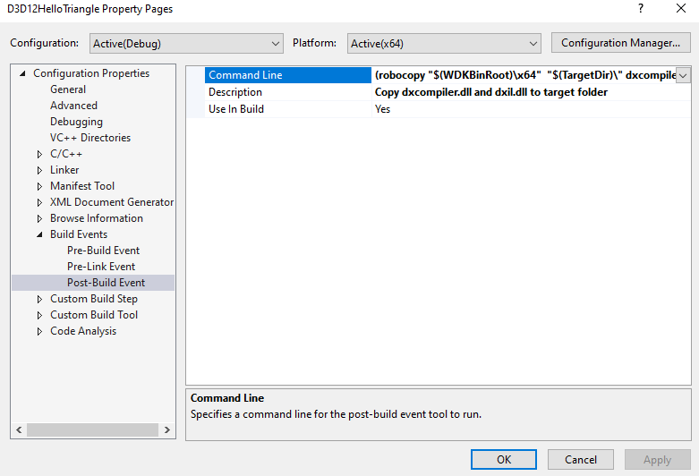
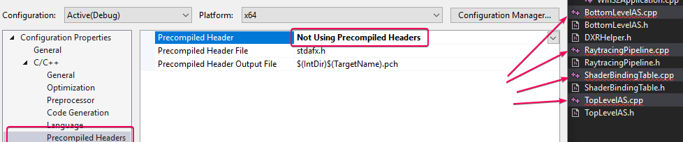

# DirectX-RTX-Tutorials 0
This is the starting point of this [Tutorial](https://developer.nvidia.com/rtx/raytracing/dxr/dx12-raytracing-tutorial-part-1)
### Credit for the original work goes to Martin-Karl Lefrançois and Pascal Gautron. 
### I am only filling in the gaps in explaination and fixing broken code
### This goes up to step 6.7 

## Fixed:
logic_error by adding
```c++
#include <stdexcept>
```
wstring by adding #include < xstring >
```c++
#include <xstring>
```

## 1. NVIDIA DXR Sample
Welcome to Part 1 of the DirectX 12 DXR ray tracing tutorial. The focus of these documents and the provided code is to showcase a basic integration of raytracing within an existing DirectX 12 sample, using the new DXR API. Note that for educational purposes all the code is contained in a very small set of files. A real integration would require additional levels of abstraction.

## 2. Introduction
The recent integration of ray tracing into the DirectX 12 API, called DXR, has spawned a great deal of excitement among game developers. This post, along with the provided code showcases a basic tutorial on integrating ray tracing within an existing DirectX 12 sample using the new DXR API. You’ll learn how to add ray tracing to an existing application so that the ray tracing and raster paths share the same geometry buffers. This part one of a two-part tutorial, which deals with the initial setup of Windows 10 and DX12 for ray tracing. These two posts showcase basic intergration of ray tracing within an existing DirectX sample. 

## 2.1 Goal of the Tutorial
The goal of this tutorial is to add raytracing to an existing program, so that the raytracing and raster paths share the same geometry buffers. Step-by-step, we will go through the major building blocks required to do raytracing. You will also be invited to add code snippets that will enable the ray-tracer step-by-step. The following building blocks are required to add raytracing functionalities:

* Detecting and enabling raytracing features
* Creating the bottom- and top-level acceleration structures (BLAS and TLAS) providing high-performance ray-geometry intersection capabilities
* Creating and adding shaders: Ray Generation, Hit and Miss describing how to create new rays, and what to do upon an intersection or miss
* Creating a raytracing pipeline with the various programs: Ray Generation, Hit and Miss. This is used to pack together all the shaders used in the raytracing process
* Creating a shading binding table (SBT) associating the geometry with the corresponding shaders
In the Extras we will extend the minimal program by adding some more elements: See the Going Further section. We will add the ability to switch between raster and raytracing, by pressing the SPACEBAR. At any time you can go to the References section, providing external links to more resources around DXR.

## 3. Windows Version
Before going further: make sure you are running Windows 10 Version 1809 or later.

## 4. Starting point: Hello Triangle
There are many samples for DirectX 12 under Microsoft GitHub, but for this example, you only need HelloTriangle.

### HelloTriangle [Download](https://developer.nvidia.com/rtx/raytracing/dxr/tutorial/Files/HelloTriangle.zip) the HelloTriangle Zip
Make sure that you have the latest Windows SDK installed

Open the solution, build and run.


The result of the HelloTriangle from Microsoft

### Errors on compilation If you have a compilation issue, check that you have the latest Windows SDK installed. Right-Click the solution and select “Retarget solution” to the latest SDK.

## 5. DXR Utilities
In the following tutorial, we will use some utility functions that are abstracting some really verbose implementation. The implementation of those abstractions, available here, is fully documented and should help clarifying the concepts of DXR.

## 5.1 DXCompiler.dll
The HelloTriangle example from Nvidia includes a Post-Build Event that looks for dxcompiler.dll and dxil.dll in the C:\x64\ folder.



[Download the latest release](https://github.com/microsoft/DirectXShaderCompiler/releases) and extract it to C:\x64\

### DXR Helpers [Download](https://developer.nvidia.com/rtx/raytracing/dxr/tutorial/Files/DXRHelpers.zip) the utility classes and copy to the project directory.

1. Add the utility files to the solution
2. Select all .cpp and set the precompile flag to Not Using Precompiled Headers 

3. Add $(ProjectDir) to the project include C/C++> General> Additional Include Directories

### After each step, you should be able to run the sample. At this point, nothing visual has changed.

## 6. Enabling Raytracing Capabilities

### 6.1 Raytracing-enabled Device and Command List
Our sample uses the simplest APIs of DirectX12, exposed in the ID3D12Device and ID3D12GraphicsCommandList classes. The raytracing APIs are much more advanced and recent, and were included in the ID3D12Device5 and ID3D12GraphicsCommandList4 classes. In D3D12HelloTriangle.h, we replace the declaration of m_device and m_commandList accordingly:

```c++
	ComPtr<ID3D12Device5> m_device; // renamed from ID3D12Device to ID3D12Device5
	ComPtr<ID3D12GraphicsCommandList4> m_commandList; // renamed from ID3D12GraphicsCommandList to ID3D12GraphicsCommandList4
  ```

## Checking for Raytracing Support
In `D3D12HelloTriangle.h`, we add a method for checking whether the device supports raytracing:
```c++
void CheckRaytracingSupport();
```
The body of the function is added to the D3D12HelloTriangle.cpp file. The raytracing features are part of the D3D12_FEATURE_DATA_D3D12_OPTIONS5 feature set:

```c++
void D3D12HelloTriangle::CheckRaytracingSupport()
{
	D3D12_FEATURE_DATA_D3D12_OPTIONS5 options5 = {};
	ThrowIfFailed(m_device->CheckFeatureSupport(D3D12_FEATURE_D3D12_OPTIONS5,
		&options5, sizeof(options5)));
	if (options5.RaytracingTier < D3D12_RAYTRACING_TIER_1_0)
		throw std::runtime_error("Raytracing not supported on device");
}
```
We then add a call to this method at the end of OnInit:

We will also add the ability to switch between Raster and RayTracing by pressing the `SPACEBAR`.
In `D3D12HelloTriangle.h`, for convenience, we also introduce a function to switch between raytracing and raster at runtime.

```c++
OnKeyUp(UINT8 key); 
bool m_raster = true;
```
All the code snippets go into the private section.

### 6.2 OnInit()
In the original D3D12HelloTriangle sample, the LoadAssets method creates, initializes and closes the command list. The raytracing setup will require an open command list, and for clarity we prefer adding the methods initializing the raytracing in the OnInit method. Therefore we need to move the following lines from LoadAssets() and put them at the end of the OnInit() function.
```c++
// Command lists are created in the recording state, but there is
// nothing to record yet. The main loop expects it to be closed, so
// close it now.
ThrowIfFailed(m_commandList->Close());
```
### 6.3 LoadPipeline()
This is not required, but for consistency you can change the feature level to D3D_FEATURE_LEVEL_12_1.

### 6.4PopulateCommandList()
Find the block clearing the buffer and issuing the draw commands:
```c++
const float clearColor[] = { 0.0f, 0.2f, 0.4f, 1.0f };
m_commandList->IASetPrimitiveTopology(D3D_PRIMITIVE_TOPOLOGY_TRIANGLELIST);
m_commandList->ClearRenderTargetView(rtvHandle, clearColor, 0, nullptr);
m_commandList->IASetVertexBuffers(0, 1, &m_vertexBufferView);
m_commandList->DrawInstanced(3, 1, 0, 0);
```
and replace it by the following, so that we will execute this block only in rasterization mode. In the raytracing path we will simply clear the buffer with a different color for now.
```c++
// 6.4
if (m_raster)
{
	// Record commands.
	const float clearColor[] = { 0.0f, 0.2f, 0.4f, 1.0f };
	m_commandList->ClearRenderTargetView(rtvHandle, clearColor, 0, nullptr);
	m_commandList->IASetPrimitiveTopology(D3D_PRIMITIVE_TOPOLOGY_TRIANGLELIST);
	m_commandList->IASetVertexBuffers(0, 1, &m_vertexBufferView);
	m_commandList->DrawInstanced(3, 1, 0, 0);
}
else
{
	const float clearColor[] = { 0.6f, 0.8f, 0.4f, 1.0f }; m_commandList->ClearRenderTargetView(rtvHandle, clearColor, 0, nullptr);
}
```

### 6.5 OnKeyUp()
Add the following function for toggling between raster and ray-traced modes.

```c++
void D3D12HelloTriangle::OnKeyUp(UINT8 key)
{
	// Alternate between rasterization and raytracing using the spacebar
	if (key == VK_SPACE) {
		m_raster = !m_raster;
	}
}
```

### 6.6 WindowProc()
The following is not required, but it adds the convenience to quit the application by pressing the ESC key. In the Win32Application.cpp file, in WindowProc, add the following code to the WM_KEYDOWN case to quit the application.
```c++
if (static_cast<UINT8>(wParam) == VK_ESCAPE) 
	PostQuitMessage(0);
```

### 6.7 Result
If everything went well, you should be able to compile, run and when pressing the spacebar, toggle between raster and raytracing mode. We are not doing any raytracing yet, but this will be our starting point.
