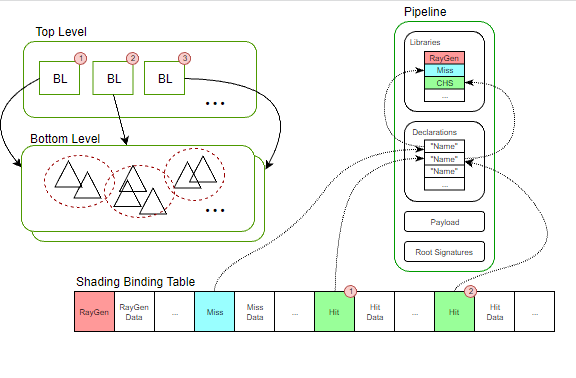
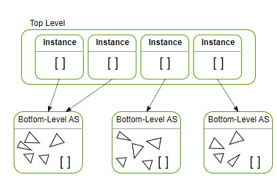

# Acceleration Structures

## 7. Overview of the System
Raytracing using DXR requires 3 main building blocks. The acceleration structures store the geometric information to optimize the search for ray intersection points, and are separated into the bottom-level (BLAS) and top-level (TLAS). The raytracing pipeline contains the compiled programs along with the function names associated to each shader program, as well as a description of how those shaders exchange data. Finally, the shader binding table is linking all of those pieces together by indicating which shader programs are executed for which geometry, and which resources are associated with it.

 Overview of raytracing building blocks
To facilitate the first contact with DXR, the helper classes we added previously directly map to those main blocks.

## 8. Acceleration Structure
To be efficient, raytracing requires putting the geometry in an acceleration structure (AS) that will reduce the number of ray-triangle intersection tests during rendering. In DXR this structure is divided into a two-level tree. Intuitively, this can directly map to the notion of an object in a scene graph, where the internal nodes of the graph have been collapsed into a single transform matrix for each bottom-level AS objects. Those BLAS then hold the actual vertex data of each object. However, it is also possible to combine multiple objects within a single bottom-level AS: for that, a single BLAS can be built from multiple vertex buffers, each with its own transform matrix. Note that if an object is instantiated several times within a same BLAS, its geometry will be duplicated. This can particularly be useful to improve performance on static, non-instantiated scene components (as a rule of thumb, the fewer BLAS, the better). For each BLAS, the top-level AS that will contain the object instances, each one with its own transformation matrix. We will start with a single bottom-level AS containing the vertices of the triangle and a top-level AS instancing it once with an identity transform.

 Acceleration Structure
In D3D12HelloTriangle.h, add those includes to access the API of the DirectX compiler, the top-level acceleration structure helper, and the standard vectors.

#include <dxcapi.h>#include <vector>
#include "nv_helpers_dx12/TopLevelASGenerator.h"
  
We will also need to add the following declarations at the end of the class definition. First, building an acceleration structure (AS) requires up to 3 buffers: some scratch memory used internally by the acceleration structure builder, the actual storage of the structure, and descriptors representing the instance matrices for top-level acceleration structures.

// #DXR
struct AccelerationStructureBuffers
{ ComPtr<id3d12resource> pScratch; // Scratch memory for AS builder ComPtr<id3d12resource> pResult; // Where the AS is ComPtr<id3d12resource> pInstanceDesc; // Hold the matrices of the instances
};
This tutorial will only use a single bottom-level AS, for which we only store the pResult buffer. For the top-level AS, we anticipate the possibility of implementing dynamic changes, and keep track of the generator helper class and all the AccelerationStructureBuffers structure. We also anticipate the possibility of having several instances, and store a vector whose entries associate a bottom-level AS to a transform matrix.

ComPtr<id3d12resource> m_bottomLevelAS; // Storage for the bottom Level AS
nv_helpers_dx12::TopLevelASGenerator m_topLevelASGenerator;
AccelerationStructureBuffers m_topLevelASBuffers;
std::vector<std::pair<comptr<id3d12resource>, DirectX::XMMATRIX>> m_instances;
We also introduce 3 methods:

CreateBottomLevelAS, which generates the bottom-level AS from a vector of vertex buffers in GPU memory and vertex count
CreateTopLevelAS, which generates the top-level AS from a vector of bottom-level AS and transform matrix
CreateAccelerationStructures binding the above methods together
/// Create the acceleration structure of an instance
///
/// \param vVertexBuffers : pair of buffer and vertex count
/// \return AccelerationStructureBuffers for TLAS
AccelerationStructureBuffers
CreateBottomLevelAS(std::vector<std::pair<comptr<id3d12resource>, uint32_t>> vVertexBuffers);
/// Create the main acceleration structure that holds
/// all instances of the scene
/// \param instances : pair of BLAS and transform
void CreateTopLevelAS( const std::vector<std::pair<comptr<id3d12resource>, DirectX::XMMATRIX>>& instances);
/// Create all acceleration structures, bottom and top
void CreateAccelerationStructures();
In D3D12HelloTriangle.cpp, we will add the implementation of those methods. First, include the following to access some helper functions and the bottom-level AS helper class:

#include "DXRHelper.h"
#include "nv_helpers_dx12/BottomLevelASGenerator.h"
CreateBottomLevelAS
To create the bottom level acceleration structure (BLAS), we are calling CreateBottomLevelAS and passing an array of two elements (pair). The first element is the pointer to the resource holding the vertices of the geometry, the second is the number of vertices. Note that we are assuming that the resource contains Vertex structures. For the sake of simplicity, we do not use indexing: triangles are described by 'Vertex' triplets. Indexing is supported by the helper class, though, please see the Going Further section for the details. The function CreateBottomLevelAS is divided into 3 main steps. First , it combines all the vertex buffers into the BLAS builder helper class. The BLAS generation is performed on GPU, and the second step computes the storage requirements to hold the final BLAS as well as some temporary space by calling ComputeASBufferSizes. This maps to the actual DXR API, which requires the application to allocate the space for the BLAS as well as the temporary (scratch) space. This scratch space can be freed as soon as the build is complete, ie. after the execution of the command list containing the build request is completed. Internally, the ComputeASBufferSizes method calls ID3D12Device5::GetRaytracingAccelerationStructurePrebuildInfo which will give a conservative estimate of the memory requirements. The buffers can then be allocated directly in GPU memory on the default heap. Finally, the BLAS can be generated by calling the Generate method. It will create a descriptor of the acceleration structure building work with a D3D12_RAYTRACING_ACCELERATION_STRUCTURE_TYPE_BOTTOM_LEVEL type, and call ID3D12GraphicsCommandList4::BuildRaytracingAccelerationStructure() with that descriptor. The resulting BLAS contains the full definition of the geometry, organized in a way suitable for efficiently finding ray intersections with that geometry.

//-----------------------------------------------------------------------------
//
// Create a bottom-level acceleration structure based on a list of vertex
// buffers in GPU memory along with their vertex count. The build is then done
// in 3 steps: gathering the geometry, computing the sizes of the required
// buffers, and building the actual AS
//
D3D12HelloTriangle::AccelerationStructureBuffers
D3D12HelloTriangle::CreateBottomLevelAS( std::vector<std::pair<comptr<id3d12resource>, uint32_t>> vVertexBuffers) { nv_helpers_dx12::BottomLevelASGenerator bottomLevelAS; // Adding all vertex buffers and not transforming their position. for (const auto &buffer : vVertexBuffers) { bottomLevelAS.AddVertexBuffer(buffer.first.Get(), 0, buffer.second, sizeof(Vertex), 0, 0); } // The AS build requires some scratch space to store temporary information. // The amount of scratch memory is dependent on the scene complexity. UINT64 scratchSizeInBytes = 0; // The final AS also needs to be stored in addition to the existing vertex // buffers. It size is also dependent on the scene complexity. UINT64 resultSizeInBytes = 0; bottomLevelAS.ComputeASBufferSizes(m_device.Get(), false, &scratchSizeInBytes, &resultSizeInBytes); // Once the sizes are obtained, the application is responsible for allocating // the necessary buffers. Since the entire generation will be done on the GPU, // we can directly allocate those on the default heap AccelerationStructureBuffers buffers; buffers.pScratch = nv_helpers_dx12::CreateBuffer( m_device.Get(), scratchSizeInBytes, D3D12_RESOURCE_FLAG_ALLOW_UNORDERED_ACCESS, D3D12_RESOURCE_STATE_COMMON, nv_helpers_dx12::kDefaultHeapProps); buffers.pResult = nv_helpers_dx12::CreateBuffer( m_device.Get(), resultSizeInBytes, D3D12_RESOURCE_FLAG_ALLOW_UNORDERED_ACCESS, D3D12_RESOURCE_STATE_RAYTRACING_ACCELERATION_STRUCTURE, nv_helpers_dx12::kDefaultHeapProps); // Build the acceleration structure. Note that this call integrates a barrier // on the generated AS, so that it can be used to compute a top-level AS right // after this method. bottomLevelAS.Generate(m_commandList.Get(), buffers.pScratch.Get(), buffers.pResult.Get(), false, nullptr); return buffers;
}
CreateTopLevelAS
The top level acceleration structure (TLAS) can be seen as an acceleration structure over acceleration structures, which aims at optimizing the search for ray intersections in any of the underlying BLAS. A TLAS can instantiate the same BLAS multiple times, using per-instance matrices to render them at various world-space positions. In the example, we call CreateTopLevelAS and pass an array of two elements (pair). The first element is the resource pointer to the BLAS, the second is the matrix to position the object. In the Going Further section we will use those matrices to animate the scene by only updating the TLAS and keeping the BLAS fixed, making it useful for rigid-body animations. This method is very similar in structure to CreateBottomLevelAS, with the same 3 steps: gathering the input data, computing the AS buffer sizes, and generating the actual TLAS. However, the TLAS requires an additional buffer holding the descriptions of each instance. The ComputeASBufferSizes method provides the sizes of the scratch and result buffers by calling ID3D12Device5::GetRaytracingAccelerationStructurePrebuildInfo, and computes the size of the instance buffers from the size of the instance descriptor D3D12_RAYTRACING_INSTANCE_DESC and the number of instances. As for the BLAS, the scratch and result buffers are directly allocated in GPU memory, on the default heap. The instance descriptors buffer will need to be mapped within the helper, and has to be allocated on the upload heap. Once the buffers are allocated, the Generate call fills in the instance descriptions buffer and a descriptor of the building work to be done, with a D3D12_RAYTRACING_ACCELERATION_STRUCTURE_TYPE_TOP_LEVEL type. This descriptor is then passed to ID3D12GraphicsCommandList4::BuildRaytracingAccelerationStructure which builds an acceleration structure holding all the instances.

//-----------------------------------------------------------------------------
// Create the main acceleration structure that holds all instances of the scene.
// Similarly to the bottom-level AS generation, it is done in 3 steps: gathering
// the instances, computing the memory requirements for the AS, and building the
// AS itself
//
void D3D12HelloTriangle::CreateTopLevelAS( const std::vector<std::pair<comptr<id3d12resource>, DirectX::XMMATRIX>> &instances // pair of bottom level AS and matrix of the instance
) { // Gather all the instances into the builder helper for (size_t i = 0; i < instances.size(); i++) { m_topLevelASGenerator.AddInstance(instances[i].first.Get(), instances[i].second, static_cast<uint>(i), static_cast<uint>(0)); } // As for the bottom-level AS, the building the AS requires some scratch space // to store temporary data in addition to the actual AS. In the case of the // top-level AS, the instance descriptors also need to be stored in GPU // memory. This call outputs the memory requirements for each (scratch, // results, instance descriptors) so that the application can allocate the // corresponding memory UINT64 scratchSize, resultSize, instanceDescsSize; m_topLevelASGenerator.ComputeASBufferSizes(m_device.Get(), true, &scratchSize, &resultSize, &instanceDescsSize); // Create the scratch and result buffers. Since the build is all done on GPU, // those can be allocated on the default heap m_topLevelASBuffers.pScratch = nv_helpers_dx12::CreateBuffer( m_device.Get(), scratchSize, D3D12_RESOURCE_FLAG_ALLOW_UNORDERED_ACCESS, D3D12_RESOURCE_STATE_UNORDERED_ACCESS, nv_helpers_dx12::kDefaultHeapProps); m_topLevelASBuffers.pResult = nv_helpers_dx12::CreateBuffer( m_device.Get(), resultSize, D3D12_RESOURCE_FLAG_ALLOW_UNORDERED_ACCESS, D3D12_RESOURCE_STATE_RAYTRACING_ACCELERATION_STRUCTURE, nv_helpers_dx12::kDefaultHeapProps); // The buffer describing the instances: ID, shader binding information, // matrices ... Those will be copied into the buffer by the helper through // mapping, so the buffer has to be allocated on the upload heap. m_topLevelASBuffers.pInstanceDesc = nv_helpers_dx12::CreateBuffer( m_device.Get(), instanceDescsSize, D3D12_RESOURCE_FLAG_NONE, D3D12_RESOURCE_STATE_GENERIC_READ, nv_helpers_dx12::kUploadHeapProps); // After all the buffers are allocated, or if only an update is required, we // can build the acceleration structure. Note that in the case of the update // we also pass the existing AS as the 'previous' AS, so that it can be // refitted in place. m_topLevelASGenerator.Generate(m_commandList.Get(), m_topLevelASBuffers.pScratch.Get(), m_topLevelASBuffers.pResult.Get(), m_topLevelASBuffers.pInstanceDesc.Get());
}
CreateAccelerationStructures
The CreateAccelerationStructures function calls AS builders for the bottom and the top, and store the generated structures. Note that while we only keep resulting BLAS of the triangle and discard the scratch space, we store all buffers for the TLAS into m_topLevelASBuffers in anticipation of the handling of dynamic scenes, where the scratch space will be used repeatedly. This method first fills the command list with the build orders for the bottom-level acceleration structures. For each BLAS, the helper introduces a resource barrier D3D12_RESOURCE_BARRIER_TYPE_UAV to ensure the BLAS can be queried within the same command list. This is required as the top-level AS is also built in that command list. After enqueuing the AS build calls, we execute the command list immediately by calling ExecuteCommandLists and using a fence to flush the command list before starting rendering.

//-----------------------------------------------------------------------------
//
// Combine the BLAS and TLAS builds to construct the entire acceleration
// structure required to raytrace the scene
//
void D3D12HelloTriangle::CreateAccelerationStructures() { // Build the bottom AS from the Triangle vertex buffer AccelerationStructureBuffers bottomLevelBuffers = CreateBottomLevelAS({{m_vertexBuffer.Get(), 3}}); // Just one instance for now m_instances = {{bottomLevelBuffers.pResult, XMMatrixIdentity()}}; CreateTopLevelAS(m_instances); // Flush the command list and wait for it to finish m_commandList->Close(); ID3D12CommandList *ppCommandLists[] = {m_commandList.Get()}; m_commandQueue->ExecuteCommandLists(1, ppCommandLists); m_fenceValue++; m_commandQueue->Signal(m_fence.Get(), m_fenceValue); m_fence->SetEventOnCompletion(m_fenceValue, m_fenceEvent); WaitForSingleObject(m_fenceEvent, INFINITE); // Once the command list is finished executing, reset it to be reused for // rendering ThrowIfFailed( m_commandList->Reset(m_commandAllocator.Get(), m_pipelineState.Get())); // Store the AS buffers. The rest of the buffers will be released once we exit // the function m_bottomLevelAS = bottomLevelBuffers.pResult;
}
OnInit()
We can now add the call to create the acceleration structures. The method should look like this

void D3D12HelloTriangle::OnInit() { LoadPipeline(); LoadAssets(); // Check the raytracing capabilities of the device CheckRaytracingSupport(); // Setup the acceleration structures (AS) for raytracing. When setting up // geometry, each bottom-level AS has its own transform matrix. CreateAccelerationStructures(); // Command lists are created in the recording state, but there is // nothing to record yet. The main loop expects it to be closed, so // close it now. ThrowIfFailed(m_commandList->Close());
}
