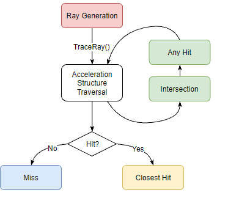

# 2 - Rendering a RTX Triangle

## 9. On to Rendering
Welcome to Part 2 of the DXR ray tracing tutorial. Part 1 showed you how to set up your Windows 10 programming environment to support writing DXR ray tracing applications. Now we take the sample application used in Part 1 to add ray tracing.

## 10. Shading Pipeline
When creating rasterization shaders with DirectX12, the application compiles them into executable shaders, which are bound to the rasterization pipeline. All objects rendered using this pipeline will use those shaders. To render an image with several types of shaders, the rasterization pipeline needs to be set to use each before calling the draw commands. In a raytracing context, a ray traced to the scene can hit any object and thus trigger the execution of any shader. Instead of using one shader executable at a time, we now need to have all shaders available at once. The pipeline then contains all the shader required to render the scene, and information on how to execute it. To be able to raytrace some geometry, a DXR pipeline typically uses at least those 3 HLSL shader program types:

* The ray generation program, that will be the starting point of the raytracing, and called for each pixel: it will typically initialize a ray descriptor RayDesc starting at the location of the camera, in a direction given by evaluating the camera lens model at the pixel location. It will then invoke TraceRay(), that will shoot the ray in the scene. Other shaders below will process further events, and return their result to the ray generation shader through the ray payload.
* The miss shader is executed when a ray does not intersect any geometry. It can typically sample an environment map, or return a simple color through the ray payload.
* The closest hit shader is called upon hitting a the geometric instance closest to the starting point of the ray. This shader can for example perform lighting calculations, and return the results through the ray payload. There can be as many closest hit shaders as needed, in the same spirit as a rasterization-based application has multiple pixel shaders depending on the objects.

Two more shader types can optionally be used:

* The intersection shader, which allows intersecting user-defined geometry. For example, this can be particularly useful when intersecting procedural geometry or subdivision surfaces without tesselating them beforehand. It can return an arbitrary number of values, up to D3D12_RAYTRACING_MAX_ATTRIBUTE_SIZE_IN_BYTES, which is 32 at the time of writing this tutorial. Using this shader requires modifying how the acceleration structures are built, and is beyond the scope of this tutorial. We will instead rely on the built-in triangle intersection shader provided by DXR, which returns a structure of 2 floating-point values representing the barycentric coordinates (u,v) of the hit point inside the triangle. For a triangle made of vertices v0, v1, v2, the barycentric coordinates define the weights of the vertices as follows:

* The any hit shader is executed on each potential intersection: when searching for the hit point closest to the ray origin, several candidates may be found on the way. The any hit shader can typically be used to efficiently implement alpha-testing. If the alpha test fails, the ray traversal can continue without having to call TraceRay() again. The built-in any hit shader is simply a pass-trough returning the intersection to the traversal engine that will determine which potential intersection is the closest.

Figure 1:

 

The Raytracing Pipeline

In this tutorial we will create a pipeline containing only the 3 mandatory shader programs: a single ray generation, single miss and a single closest hit. This is done by first compiling each shader program into a DirectX Intermediate Language (DXIL) library using the DirectX Compiler IDxcCompiler with the target lib_6_3. This target has been introduced with DXR. Such libraries will be linked together within the raytracing pipeline, which will be able to route the intersection calculations to the right hit shaders. To be able to focus on the pipeline generation, we provide simplistic shaders:

### Shaders - [Download](https://developer.nvidia.com/rtx/raytracing/dxr/tutorial/Files/Shaders.zip) the shaders and extract the content to the main folder.
### Adding to the Solution - If you are adding the shaders to the solution, you need to exclude them from compilation otherwise you will get compilation errors.

This archive contains 4 files:

* Common.hlsl is included by the other shaders, and defines the ray payload HitInfo which will be used to communicate information between shaders. It only contains a float4 vector representing the color at the hit point and the distance from the ray origin to that hit point. This file also declares the structure Attributes which will be used to store the float2 barycentric coordinates returned by the intersection shader.
* RayGen.hlsl contains the ray generation program RayGen(), flagged by its semantic [shader("raygeneration")] . It also declares its access to the raytracing output buffer gOutput bound as a unordered access view (UAV), and the raytracing acceleration structure SceneBVH, bound as a shader resource view (SRV). For now this shader program simply writes a constant color in the raytracing output buffer.
* Miss.hlsl defines the Miss() shader, with its semantic [shader(“miss”)]. This shader will be executed when no geometry is hit, and will write a constant color in the payload. Note that this shader takes the payload as a inout parameter. It will be provided to the shader automatically by DXR. Since our current ray generation program does not trace any ray for now, this shader will not be called.
* Hit.hlsl contains a very simple closest hit shader ClosestHit(), with its semantic [shader("closesthit")] . It will be executed upon hitting the geometry (our triangle). As the miss shader, it takes the ray payload payload as a inout parameter. It also has a second parameter defining the intersection attributes as provided by the intersection shader, ie. the barycentric coordinates. This shader simply writes a constant color to the payload, as well as the distance from the origin, provided by the built-in RayCurrentT() function.

## 10.1 Root Signatures and Shader Libraries
Shaders usually require external data, such as textures, constant buffers etc. Those inputs are specified in the shader code, by binding data to a given register: RWTexture2D< float4 > gOutput : register(u0);. In this case, the register means the data is accessible in the first unordered access variable (UAV, identified by the letter u) bound to the shader. Constant buffers (CBV), can be accessed using the letter b. Shader resources (SRV) correspond to the letter t. The usage of simple numbers to identify the index of the accessed buffer can cause problems when addressing ranges of buffers with unknown size. This is particularly useful when assembling shaders from several sources when generating shader permutations. HLSL introduces the notion of space, which allows reusing the same resource index while avoiding collisions:

```c++
RWTexture2D<float4> gOutput : register(u0, space0);
RWTexture2D<float4> gEnvironment : register(u0, space1);
```
When space is not specified, space0 is used. The binding of the resources is also defined explicitly using root signatures, which must match the order and types defined within the shader. Each binding in ther shader corresponds to an entry in the root signature. A root signature entry is defined by a D3D12_ROOT_PARAMETER. Each entry has a type, such as D3D12_ROOT_PARAMETER_TYPE_CBV for a direct access to a pointer on a constant buffer. Such direct accesses can also be used for UAV (D3D12_ROOT_PARAMETER_TYPE_UAV) and shader resources (D3D12_ROOT_PARAMETER_TYPE_SRV). An entry can also be a set of directly specified constants (D3D12_ROOT_PARAMETER_TYPE_32BIT_CONSTANTS), which correspond to register (b). Finally, an entry can also point to ranges of slots within the currently bound heap (D3D12_ROOT_PARAMETER_TYPE_DESCRIPTOR_TABLE). Note that even if a shader does not access external resources (e.g. returning a hardcoded color) a root signature needs to be defined. In this case the signature will not have any parameters. We therefore add the following declarations in the header files: methods to create the root signatures and the pipeline itself, the storage for the IDxcBlob containing the DXIL libraries of the shaders, the root signatures of the shaders, and the pipeline object itself m_rtStateObject. This latter will also to be cast to a ID3D12StateObjectProperties as well to access some of its functionalities, particularly the method looking up shader identifiers using their name string, ID3D12StateObjectProperties::GetShaderIdentifier().

```c++
// 10.1 #DXR
ComPtr<ID3D12RootSignature> CreateRayGenSignature();
ComPtr<ID3D12RootSignature> CreateHitSignature();
ComPtr<ID3D12RootSignature> CreateMissSignature();

void CreateRaytracingPipeline();

ComPtr<IDxcBlob> m_rayGenLibrary;
ComPtr<IDxcBlob> m_hitLibrary;
ComPtr<IDxcBlob> m_missLibrary;

ComPtr<ID3D12RootSignature> m_rayGenSignature;
ComPtr<ID3D12RootSignature> m_hitSignature;
ComPtr<ID3D12RootSignature> m_missSignature;

// Ray tracing pipeline state
ComPtr<ID3D12StateObject> m_rtStateObject;
// Ray tracing pipeline state properties, retaining the shader identifiers
// to use in the Shader Binding Table
ComPtr<ID3D12StateObjectProperties> m_rtStateObjectProps;
```

In D3D12HelloTriangle.cpp add the following includes to access the helper classes for the generation of the raytracing pipeline and the root signatures.

```c++
#include "nv_helpers_dx12/RaytracingPipelineGenerator.h"
#include "nv_helpers_dx12/RootSignatureGenerator.h"
```

## 10.2 CreateRayGenSignature
The root signature of the RayGen program indicates the program needs to access the image output and the buffer containing the Top Level Acceleration Structure. For the sake of simplicity the root signatures introduced in this tutorial use our RootSignatureGenerator helper. The Add* methods essentially create D3D12_ROOT_PARAMETER descriptors for each entry, while the Generate call combine the descriptors into a D3D12_ROOT_SIGNATURE_DESC, itself used to call D3D12SerializeRootSignature and ID3D12Device::CreateRootSignature.

```c++
// 10.2
//-----------------------------------------------------------------------------
// The ray generation shader needs to access 2 resources: the raytracing output
// and the top-level acceleration structure
//

ComPtr<ID3D12RootSignature> D3D12HelloTriangle::CreateRayGenSignature() 
{ 
	nv_helpers_dx12::RootSignatureGenerator rsc;
	rsc.AddHeapRangesParameter(
		{ {0 /*u0*/, 1 /*1 descriptor */, 0 /*use the implicit register space 0*/,
		  D3D12_DESCRIPTOR_RANGE_TYPE_UAV /* UAV representing the output buffer*/,
		  0 /*heap slot where the UAV is defined*/},
		 {0 /*t0*/, 1, 0,
		  D3D12_DESCRIPTOR_RANGE_TYPE_SRV /*Top-level acceleration structure*/,
		  1} });

	return rsc.Generate(m_device.Get(), true);
}
```

## 10.3 CreateHitSignature
At first, our closest hit program will not need any external data. When the ray will hit the triangle, we will simply return a color in the payload, as indicated in Hit.hlsl.

```c++
// 10.3
//-----------------------------------------------------------------------------
// The hit shader communicates only through the ray payload, and therefore does
// not require any resources
//
ComPtr<ID3D12RootSignature> D3D12HelloTriangle::CreateHitSignature() 
{
	nv_helpers_dx12::RootSignatureGenerator rsc;
	return rsc.Generate(m_device.Get(), true);
}
```

## 10.4 CreateMissSignature
The root signature of the miss shader is also empty since this shader only communicates through the ray payload.

```c++
// 10.4
//-----------------------------------------------------------------------------
// The miss shader communicates only through the ray payload, and therefore
// does not require any resources
//
ComPtr<ID3D12RootSignature> D3D12HelloTriangle::CreateMissSignature() 
{
	nv_helpers_dx12::RootSignatureGenerator rsc;
	return rsc.Generate(m_device.Get(), true);
}
```
	
## 10.5 CreateRaytracingPipeline
The raytracing pipeline binds the shader code, root signatures and pipeline characteristics in a single structure used by DXR to invoke the shaders and manage temporary memory during raytracing. The setup of the pipeline requires creating and combining numerous DirectX 12 subobjects, a concept introduced with DXR. In this tutorial we use the RayTracingPipeline helper to simplify the code and enforce consistency across the created objects. Internally, each Add* method corresponds to one or more D3D12_STATE_SUBOBJECT added to an array of such subobjects defining the pipeline. We start the method by generating the DXIL libraries for each shader. This helper function first opens the indicated file and loads its contents. If needed, it initializes the compiler and creates a IDxcBlobEncoding structure from the file contents by calling IDxcLibrary::CreateBlobWithEncodingFromPinned(). It then compiles the data by calling IDxcCompiler::Compile(), which returns the IDxcBlob pointer that we store in the class.

```c++
// 10.5
//-----------------------------------------------------------------------------
//
// The raytracing pipeline binds the shader code, root signatures and pipeline
// characteristics in a single structure used by DXR to invoke the shaders and
// manage temporary memory during raytracing
//
//
void D3D12HelloTriangle::CreateRaytracingPipeline() 
{
	nv_helpers_dx12::RayTracingPipelineGenerator pipeline(m_device.Get());

	// The pipeline contains the DXIL code of all the shaders potentially executed
	// during the raytracing process. This section compiles the HLSL code into a
	// set of DXIL libraries. We chose to separate the code in several libraries
	// by semantic (ray generation, hit, miss) for clarity. Any code layout can be
	// used.
	m_rayGenLibrary = nv_helpers_dx12::CompileShaderLibrary(L"RayGen.hlsl");
	m_missLibrary = nv_helpers_dx12::CompileShaderLibrary(L"Miss.hlsl");
	m_hitLibrary = nv_helpers_dx12::CompileShaderLibrary(L"Hit.hlsl");

	// In a way similar to DLLs, each library is associated with a number of
	// exported symbols. This
	// has to be done explicitly in the lines below. Note that a single library
	// can contain an arbitrary number of symbols, whose semantic is given in HLSL
	// using the [shader("xxx")] syntax
	pipeline.AddLibrary(m_rayGenLibrary.Get(), { L"RayGen" });
	pipeline.AddLibrary(m_missLibrary.Get(), { L"Miss" });
	pipeline.AddLibrary(m_hitLibrary.Get(), { L"ClosestHit" });

	// To be used, each DX12 shader needs a root signature defining which
	// parameters and buffers will be accessed.
	m_rayGenSignature = CreateRayGenSignature();
	m_missSignature = CreateMissSignature();
	m_hitSignature = CreateHitSignature();

	// 3 different shaders can be invoked to obtain an intersection: an
	// intersection shader is called
	// when hitting the bounding box of non-triangular geometry. This is beyond
	// the scope of this tutorial. An any-hit shader is called on potential
	// intersections. This shader can, for example, perform alpha-testing and
	// discard some intersections. Finally, the closest-hit program is invoked on
	// the intersection point closest to the ray origin. Those 3 shaders are bound
	// together into a hit group.

	// Note that for triangular geometry the intersection shader is built-in. An
	// empty any-hit shader is also defined by default, so in our simple case each
	// hit group contains only the closest hit shader. Note that since the
	// exported symbols are defined above the shaders can be simply referred to by
	// name.

	// Hit group for the triangles, with a shader simply interpolating vertex
	// colors
	pipeline.AddHitGroup(L"HitGroup", L"ClosestHit");

	// The following section associates the root signature to each shader. Note
	// that we can explicitly show that some shaders share the same root signature
	// (eg. Miss and ShadowMiss). Note that the hit shaders are now only referred
	// to as hit groups, meaning that the underlying intersection, any-hit and
	// closest-hit shaders share the same root signature.
	pipeline.AddRootSignatureAssociation(m_rayGenSignature.Get(), { L"RayGen" });
	pipeline.AddRootSignatureAssociation(m_missSignature.Get(), { L"Miss" });
	pipeline.AddRootSignatureAssociation(m_hitSignature.Get(), { L"HitGroup" });

	// The payload size defines the maximum size of the data carried by the rays,
	// ie. the the data
	// exchanged between shaders, such as the HitInfo structure in the HLSL code.
	// It is important to keep this value as low as possible as a too high value
	// would result in unnecessary memory consumption and cache trashing.
	pipeline.SetMaxPayloadSize(4 * sizeof(float)); // RGB + distance

	// Upon hitting a surface, DXR can provide several attributes to the hit. In
	// our sample we just use the barycentric coordinates defined by the weights
	// u,v of the last two vertices of the triangle. The actual barycentrics can
	// be obtained using float3 barycentrics = float3(1.f-u-v, u, v);
	pipeline.SetMaxAttributeSize(2 * sizeof(float)); // barycentric coordinates

	// The raytracing process can shoot rays from existing hit points, resulting
	// in nested TraceRay calls. Our sample code traces only primary rays, which
	// then requires a trace depth of 1. Note that this recursion depth should be
	// kept to a minimum for best performance. Path tracing algorithms can be
	// easily flattened into a simple loop in the ray generation.
	pipeline.SetMaxRecursionDepth(1);

	// Compile the pipeline for execution on the GPU
	m_rtStateObject = pipeline.Generate();

	// Cast the state object into a properties object, allowing to later access
	// the shader pointers by name
	ThrowIfFailed(m_rtStateObject->QueryInterface(IID_PPV_ARGS(&m_rtStateObjectProps)));
}
```

A DXIL library can be seen similarly as a regular DLL, which contains compiled code that can be accessed using a number of exported symbols. In the case of the raytracing pipeline, such symbols correspond to the names of the functions implementing the shader programs. For each file, we then add the library pointer in the pipeline, along with the name of the function it contains. Note that a single library can export an arbitrary number of symbols, and that the pipeline is allowed to only import a subset of those.

As described at the beginning of this section, to each shader corresponds a root signature defining
its external inputs.

```c++
// To be used, each DX12 shader needs a root signature defining which
// parameters and buffers will be accessed.
m_rayGenSignature = CreateRayGenSignature();
m_missSignature = CreateMissSignature();
m_hitSignature = CreateHitSignature();
```
 
The computation of the intersection of the ray with the geometry is separated into the intersection shader, the any hit shader, and the closest hit shader. Those 3 shaders are bound together into a hit group. In our case we use the built-in intersection and any hit shaders, so our hit group HitGroup only contains the closest hit shader ClosestHit.

To be used, each shader needs to be associated to its root signature. A shaders imported from the DXIL libraries needs to be associated with exactly one root signature. The shaders comprising the hit groups need to share the same root signature, which is associated to the hit group (and not to the shaders themselves). Note that a shader does not have to actually access all the resources declared in its root signature, as long as the root signature defines a superset of the resources the shader needs.

```c++
// The following section associates the root signature to each shader. Note
// that we can explicitly show that some shaders share the same root signature
// (eg. Miss and ShadowMiss). Note that the hit shaders are now only referred
// to as hit groups, meaning that the underlying intersection, any-hit and
// closest-hit shaders share the same root signature.
pipeline.AddRootSignatureAssociation(m_rayGenSignature.Get(), { L"RayGen" });
pipeline.AddRootSignatureAssociation(m_missSignature.Get(), { L"Miss" });
pipeline.AddRootSignatureAssociation(m_hitSignature.Get(), { L"HitGroup" });
```

The Set* methods setup specific subobjects related to the global properties of the pipeline itself:

* The maximum payload size used by the shaders, which defines the amount of data a shader can exchange with other shaders. A typical example is a payload containing a color value, so that the hit or miss shaders can return this value to the ray generation program, which will write that value to the output buffer. To achieve best performance the payload needs to be kept as small as possible. In our case the payload contains 4 floating-point values stored in the HitInfo structure in Common.hlsl, representing the output color and the distance of the hit from the ray origin.
* The attributes size, which is set by the intersection shader. We use the built-in triangle intersection shader that return 2 floating-point values corresponding to the barycentric coordinates of the hit point inside the triangle. Those values are accessed using the Attributes structure in Common.hlsl
* The maximum recursion depth, which describes how many nested TraceRay() calls can be made while tracing. One level of recursion can for example be used to shoot shadow rays from a hit point. Note that, however, this recursion level must be kept as low as possible for performance. Therefore, implementing a path tracer should not be done using recursion: the multiple bounces should be implemented in a loop in the ray generation program instead. In our case, we will only call TraceRay() once to cast a ray from the camera without further bounces, hence a recursion level of 1.

The pipeline now has all the information it needs. We generate the pipeline by calling the `Generate`
method of the helper, which creates the array of subobjects and calls
```c++
m_device->CreateStateObject
```

## 10.6 OnInit()
Add the call at the end of the function to create the raytracing pipeline

```c++
// 10.6
// Create the raytracing pipeline, associating the shader code to symbol names
// and to their root signatures, and defining the amount of memory carried by
// rays (ray payload)
CreateRaytracingPipeline();
```

## 3 Creating Resources
Unlike the rasterization, the raytracing process does not write directly to the render target: instead, it writes its results into a buffer bound as an unordered access view (UAV), which is then copied to the render target for display. Also, any shader program that calls TraceRay() needs to be able to access the top-level acceleration structure (TLAS). As shown in the Shading Pipeline section, the root signature of the ray generation shader defines the access to both buffers as two ranges within a resource heap. In this section we will first create the raytracing output buffer m_outputResource, and then create the heap m_srvUavHeap referencing both that buffer and the TLAS. Add the following declaration in D3D12HelloTriangle.h

// #DXR
void CreateRaytracingOutputBuffer();
void CreateShaderResourceHeap();
ComPtr<id3d12resource> m_outputResource;
ComPtr<id3d12descriptorheap> m_srvUavHeap;
CreateRaytracingOutputBuffer
The method below allocates the buffer holding the raytracing output using ID3D12Device::CreateCommittedResource, with the same size as the output image. This buffer is initialized in the copy source state D3D12_RESOURCE_STATE_COPY_SOURCE, which is the state assumed by the PopulateCommandList method. That method will transition the buffer to a D3D12_RESOURCE_STATE_UNORDERED_ACCESS, perform raytracing and transition back to D3D12_RESOURCE_STATE_COPY_SOURCE so that the contents of the buffer can be copied to the render target using ID3D12GraphicsCommandList::CopyResource. It is then important that the raytracing output buffer is created with the D3D12_RESOURCE_FLAG_ALLOW_UNORDERED_ACCESS flag.

//-----------------------------------------------------------------------------
//
// Allocate the buffer holding the raytracing output, with the same size as the
// output image
//
void D3D12HelloTriangle::CreateRaytracingOutputBuffer() { D3D12_RESOURCE_DESC resDesc = {}; resDesc.DepthOrArraySize = 1; resDesc.Dimension = D3D12_RESOURCE_DIMENSION_TEXTURE2D; // The backbuffer is actually DXGI_FORMAT_R8G8B8A8_UNORM_SRGB, but sRGB // formats cannot be used with UAVs. For accuracy we should convert to sRGB // ourselves in the shader resDesc.Format = DXGI_FORMAT_R8G8B8A8_UNORM; resDesc.Flags = D3D12_RESOURCE_FLAG_ALLOW_UNORDERED_ACCESS; resDesc.Width = GetWidth(); resDesc.Height = GetHeight(); resDesc.Layout = D3D12_TEXTURE_LAYOUT_UNKNOWN; resDesc.MipLevels = 1; resDesc.SampleDesc.Count = 1; ThrowIfFailed(m_device->CreateCommittedResource( &nv_helpers_dx12::kDefaultHeapProps, D3D12_HEAP_FLAG_NONE, &resDesc, D3D12_RESOURCE_STATE_COPY_SOURCE, nullptr, IID_PPV_ARGS(&m_outputResource)));
}
CreateShaderResourceHeap
The data accessible to all shaders is typically referenced in a heap bound before rendering. This heap contains a predefined number of slots, each of them containing a view on an object in GPU memory. In practice, the heap is a memory area containing views on common resources. Such views are directly written into the heap memory using ID3D12Device::Create*View calls. In this tutorial the heap only contains two entries: the raytracing output buffer accessed as a UAV, and the top-level acceleration structure which is a shader resource (SRV) with a specific dimension flag D3D12_SRV_DIMENSION_RAYTRACING_ACCELERATION_STRUCTURE.

//-----------------------------------------------------------------------------
//
// Create the main heap used by the shaders, which will give access to the
// raytracing output and the top-level acceleration structure
//
void D3D12HelloTriangle::CreateShaderResourceHeap() { // Create a SRV/UAV/CBV descriptor heap. We need 2 entries - 1 UAV for the // raytracing output and 1 SRV for the TLAS m_srvUavHeap = nv_helpers_dx12::CreateDescriptorHeap( m_device.Get(), 2, D3D12_DESCRIPTOR_HEAP_TYPE_CBV_SRV_UAV, true); // Get a handle to the heap memory on the CPU side, to be able to write the // descriptors directly D3D12_CPU_DESCRIPTOR_HANDLE srvHandle = m_srvUavHeap->GetCPUDescriptorHandleForHeapStart(); // Create the UAV. Based on the root signature we created it is the first // entry. The Create*View methods write the view information directly into // srvHandle D3D12_UNORDERED_ACCESS_VIEW_DESC uavDesc = {}; uavDesc.ViewDimension = D3D12_UAV_DIMENSION_TEXTURE2D; m_device->CreateUnorderedAccessView(m_outputResource.Get(), nullptr, &uavDesc, srvHandle); // Add the Top Level AS SRV right after the raytracing output buffer srvHandle.ptr += m_device->GetDescriptorHandleIncrementSize( D3D12_DESCRIPTOR_HEAP_TYPE_CBV_SRV_UAV); D3D12_SHADER_RESOURCE_VIEW_DESC srvDesc; srvDesc.Format = DXGI_FORMAT_UNKNOWN; srvDesc.ViewDimension = D3D12_SRV_DIMENSION_RAYTRACING_ACCELERATION_STRUCTURE; srvDesc.Shader4ComponentMapping = D3D12_DEFAULT_SHADER_4_COMPONENT_MAPPING; srvDesc.RaytracingAccelerationStructure.Location = m_topLevelASBuffers.pResult->GetGPUVirtualAddress(); // Write the acceleration structure view in the heap m_device->CreateShaderResourceView(nullptr, &srvDesc, srvHandle);
}
OnInit
Add the creation of the raytracing output buffer and the resource heap at the end of OnInit:

// Allocate the buffer storing the raytracing output, with the same dimensions
// as the target image
CreateRaytracingOutputBuffer(); // #DXR
// Create the buffer containing the raytracing result (always output in a
// UAV), and create the heap referencing the resources used by the raytracing,
// such as the acceleration structure
CreateShaderResourceHeap(); // #DXR
Shader Binding Table
The Shader Binding Table is where all programs and TLAS are bind together to know which program to execute. There is one RayGen at least one Miss, followed by the Hit. There should be n entries for the Hit, up to the maximum index passed to the instance description parameter InstanceContributionToHitGroupIndex. In a typical rasterization setup, a current shader and its associated resources are bound prior to drawing the corresponding objects, then another shader and resource set can be bound for some other objects, and so on. Since raytracing can hit any surface of the scene at any time, it is impossible to know in advance which shaders need to be bound. Therefore, the Shader Binding Table (SBT) is an array of SBT entries holding information on the location of shaders and their resources for each object.

SBT Entry
A SBT entry consists of a header and data section. The header stores a shader identifier, while the data section provides pointers and raw data to the shader, according to the layout described in the root signature of the shader. In D3D12HelloTriangle.h add the following include

#include "nv_helpers_dx12/ShaderBindingTableGenerator.h"
This file contains our SBT helper that eases the SBT creation process and enforces consistency between the SBT layout and the later raytracing calls. Internally the Add* methods collect the names of the shader programs associated with the pointers of their input resources in GPU memory. The Generate call maps the input buffer and, for each collected entry, sets the corresponding shader identifier using ID3D12StateObjectProperties::GetShaderIdentifier() and copies its resource pointers afterwards. The helper first copies the ray generation programs, then the miss programs, and finally the hit groups. And add the following declaration:

// #DXR
void CreateShaderBindingTable();
nv_helpers_dx12::ShaderBindingTableGenerator m_sbtHelper;
ComPtr<id3d12resource> m_sbtStorage;
CreateShaderBindingTable
The Shader Binding Table (SBT) is the cornerstone of the raytracing setup: it links the geometry instances to their corresponding hit groups, and binds the resources to the raytracing shader program according to their root signatures. In this tutorial, we have a scene containing a single instance. The Shader Binding Table would then have 3 entries: one for the ray generation program, one for the miss program, and one for the hit group. The ray generation needs to access two external resources: the raytracing output buffer and the top-level acceleration structure. The root signature of the ray generation shader requires both resources to be available in the currently bound heap. Consequently, the shader only needs to have a pointer to the beginning of the heap. The hit group and the miss program do not use any external data, and therefore have an empty root signature. The SBT is then laid out as follows:
R
a
y
G
e
n
|
*
I
d
e
n
t
i
f
i
e
r
|
H
e
a
p
S
t
a
r
t
|
P
o
i
n
t
e
r
|
*
M
i
s
s
|
*
I
d
e
n
t
i
f
i
e
r
|
H
i
t
G
r
o
u
p
|
I
d
e
n
t
i
f
i
e
r
|
When starting the raytracing process, the identifier of the ray generation program will be used to execute its entry point for each pixel. The pointer to the heap will allow the shader to find the required resources. When the ray generation program shoots a ray, the heap pointer will be used to find the location of the top-level acceleration structure in GPU memory and trigger the tracing itself. The ray may miss all geometry, in which case the SBT will be used to find the miss shader identifier and execute the corresponding code. If the ray hits the geometry, the hit group identifier will be used to find the shaders associated to the hit group: intersection, any hit and closest hit. In order, those shaders will be executed, and the result sent to the ray generation shader. The ray generation shader can then access the raytracing output buffer from the heap, and write its result. If the scene contains several objects, with different hit groups, the SBT will contain all the hit groups and their resources. As an example, we could have 3 objects, each accessing some camera data in the main heap. Objects 0 and 1 would have each their own texture, while Object 2 would not have one. The SBT would then have this structure:
R
a
y
G
e
n
|
*
I
d
e
n
t
i
f
i
e
r
|
H
e
a
p
S
t
a
r
t
|
P
o
i
n
t
e
r
|
*
M
i
s
s
|
*
I
d
e
n
t
i
f
i
e
r
|
H
i
t
G
r
o
u
p
0
|
I
d
e
n
t
i
f
i
e
r
H
e
a
p
S
t
a
r
t
|
P
o
i
n
t
e
r
|
*
T
e
x
t
u
r
e
0
P
o
i
n
t
e
r
|
H
i
t
G
r
o
u
p
1
|
I
d
e
n
t
i
f
i
e
r
H
e
a
p
S
t
a
r
t
|
P
o
i
n
t
e
r
|
*
T
e
x
t
u
r
e
1
P
o
i
n
t
e
r
|
H
i
t
G
r
o
u
p
2
|
I
d
e
n
t
i
f
i
e
r
H
e
a
p
S
t
a
r
t
|
P
o
i
n
t
e
r
|
*
/
/
|
|
Note that HitGroup2 does not access any texture. However, the alignment requirements of the SBT force each program type (ray generation, miss, hit group) to have a fixed entry size for all of its members. The size of the entry for a given program type is then driven by the size of the largest root signature within that type: 1 for the ray generation, 0 for the miss, and 2 for the hit group. Therefore, the SBT entry is padded to respect the alignment. In many practical the raytracing process uses multiple ray types, for example to differentiate between regular rays and shadow rays. In such cases, the SBT would contain one hit group per ray type, for each object type. Going back to a sample with a single object for conciseness, adding a second ray type simply requires adding the corresponding hit group in the SBT:
R
a
y
G
e
n
|
*
I
d
e
n
t
i
f
i
e
r
|
H
e
a
p
S
t
a
r
t
|
P
o
i
n
t
e
r
|
*
M
i
s
s
|
*
I
d
e
n
t
i
f
i
e
r
|
H
i
t
G
r
o
u
p
|
I
d
e
n
t
i
f
i
e
r
|
S
h
a
d
o
w
G
r
o
u
p
I
d
e
n
t
i
f
i
e
r
|
How the pipeline associates a geometry with a hit group depends on the hit group index used when adding an instance to the top-level AS helper class. Internally, this index maps to the InstanceContributionToHitGroupIndex of the D3D12_RAYTRACING_INSTANCE_DESC descriptor. Getting back to our sample, the ray generation only needs to access the heap pointer while the other programs do not have any resource to access. We first reset the SBT, by anticipation of potential dynamic updates. We then fetch the handle on the GPU memory where the descriptors of the heap are stored using GetGPUDescriptorHandleForHeapStart

//-----------------------------------------------------------------------------
//
// The Shader Binding Table (SBT) is the cornerstone of the raytracing setup:
// this is where the shader resources are bound to the shaders, in a way that
// can be interpreted by the raytracer on GPU. In terms of layout, the SBT
// contains a series of shader IDs with their resource pointers. The SBT
// contains the ray generation shader, the miss shaders, then the hit groups.
// Using the helper class, those can be specified in arbitrary order.
//
void D3D12HelloTriangle::CreateShaderBindingTable() { // The SBT helper class collects calls to Add*Program. If called several // times, the helper must be emptied before re-adding shaders. m_sbtHelper.Reset(); // The pointer to the beginning of the heap is the only parameter required by // shaders without root parameters D3D12_GPU_DESCRIPTOR_HANDLE srvUavHeapHandle = m_srvUavHeap->GetGPUDescriptorHandleForHeapStart();
The ptr member of the GPU handle on the heap memory has a UINT64 type, even though it represents a pointer. Since the helper class only takes pointers to define shader resources, we need to cast the 64-bit integer into a 64-bit pointer.

(srvUavHeapHandle.ptr);">~~~~~~~~~~~~~~~~~~~~~~~~~~~~~~~~~~~~~~~~~~~~~~~~~~~~~~~~~~~~~~~~~~~~~~~~~~~~~~~~~~~~~~~~~~~~~~~~~~~~
We can now add the various programs used in our example: according to its root signature, the ray generation shader needs to access
the raytracing output buffer and the top-level acceleration structure referenced in the heap. Therefore, it
takes a single resource pointer towards the beginning of the heap data. The miss shader and the hit group
only communicate through the ray payload, and do not require any resource, hence an empty resource array.
Note that the helper will group the shaders by types in the SBT, so it is possible to declare them in an
arbitrary order. For example, miss programs can be added before or after ray generation programs without
affecting the result.
However, within a given type (say, the hit groups), the order in which they are added
is important. It needs to correspond to the `InstanceContributionToHitGroupIndex` value used when adding
instances to the top-level acceleration structure: for example, an instance having `InstanceContributionToHitGroupIndex==0`
needs to have its hit group added first in the SBT.
~~~~~~~~~~~~~~~~~~~~~~~~~~~~~~~~~~~~~~~~~~~~~~~~~~~~~~~~~~~~~~~~~~~~~~~~~~~~~~~~~~~~~~~~~~~~~~~~~~~~ // The ray generation only uses heap data m_sbtHelper.AddRayGenerationProgram(L"RayGen", {heapPointer}); // The miss and hit shaders do not access any external resources: instead they // communicate their results through the ray payload m_sbtHelper.AddMissProgram(L"Miss", {}); // Adding the triangle hit shader m_sbtHelper.AddHitGroup(L"HitGroup", {});
From the number of programs and hit groups and their respective numbers of parameters, the helper can compute the size of the resulting SBT. For each shader type this method simply calculates the largest number of parameters of the shaders of that type. From this, and the size of a shader identifier, the final SBT size can be obtained. We then allocate the SBT on the upload heap. This is important as the SBT generation is done through buffer mapping.

}
After adding the shader program names to the SBT entries, the Generate call of the shader binding table helper simply maps the SBT buffer, fetches the shader program identifiers from the provided names, and each entry as the program identifier followed by its set of resource pointers.

}
OnInit()
Add the following line to call the creation of the SBT.

// Create the shader binding table and indicating which shaders
// are invoked for each instance in the AS
CreateShaderBindingTable();
Calling the Raytracer
In this step, we will launch the raytracing process and copy the resulting output buffer into the render target. At this point, we still use the provided ray generation program, which does not invoke any raytracing. Instead, it simply sets an orange color in all pixels.

PopulateCommandList()
Find the if-else for the raytracing and replace the clear buffer by the call to raytracing. The main parts of this section are the setup of the raytracing descriptor D3D12_DISPATCH_RAYS_DESC which defines how to interpret the Shader Binding Table, and how many pixels need to be rendered (ie. how many threads will run the ray generation program simultaneously). The raytracing is actually performed by calling ID3D12GraphicsCommandList4::DispatchRays(). We first set the current heap as m_srvUavHeap, so that the raytracing output buffer and the top-level acceleration structure will be accessible from the shaders:

// #DXR
// Bind the descriptor heap giving access to the top-level acceleration
// structure, as well as the raytracing output
std::vector<id3d12descriptorheap*> heaps = {m_srvUavHeap.Get()};
m_commandList->SetDescriptorHeaps(static_cast<uint>(heaps.size()), heaps.data());
As previously described raytracing, unlike rasterization, cannot directly render into a render target. Instead, we need to copy the contents of the raytracing output into the render target using CD3DX12_RESOURCE_BARRIER::Transition objects. When entering the PopulateCommandList method the raytracing output buffer is in a D3D12_RESOURCE_STATE_COPY_SOURCE state. In order to allow the ray generation shader to write to the buffer as a UAV, we transition the buffer into the D3D12_RESOURCE_STATE_UNORDERED_ACCESS

// On the last frame, the raytracing output was used as a copy source, to
// copy its contents into the render target. Now we need to transition it to
// a UAV so that the shaders can write in it.
CD3DX12_RESOURCE_BARRIER transition = CD3DX12_RESOURCE_BARRIER::Transition( m_outputResource.Get(), D3D12_RESOURCE_STATE_COPY_SOURCE, D3D12_RESOURCE_STATE_UNORDERED_ACCESS);
m_commandList->ResourceBarrier(1, &transition);
The D3D12_DISPATCH_RAYS_DESC descriptor specifies the work to be done during raytracing: specifically it contains the entry points in the Shader Binding Table (SBT), and the size of the image to render. Using the helper class, the SBT always contains first the ray generation shader, then the miss shaders, and finally the hit groups. The start address of the SBT section containing the ray generation shader is then the beginning of the SBT buffer. Each ray generation entry in the SBT has the same size, which is also obtained from the helpers GetRayGenSectionSize call. This enforces consistency between the SBT and the raytracing, which is a common source of errors. Note that only one ray generation shader is allowed, since this is the entry point of the raytracing process. If several ray generation shaders were present in the SBT, we would need to offset the StartAddress of the ray generation shader record accordingly.

// Setup the raytracing task
D3D12_DISPATCH_RAYS_DESC desc = {};
// The layout of the SBT is as follows: ray generation shader, miss
// shaders, hit groups. As described in the CreateShaderBindingTable method,
// all SBT entries of a given type have the same size to allow a fixed stride.
// The ray generation shaders are always at the beginning of the SBT.
uint32_t rayGenerationSectionSizeInBytes = m_sbtHelper.GetRayGenSectionSize();
desc.RayGenerationShaderRecord.StartAddress = m_sbtStorage->GetGPUVirtualAddress();
desc.RayGenerationShaderRecord.SizeInBytes = rayGenerationSectionSizeInBytes;
The miss shaders immediately follow the ray generation shaders, hence the beginning of the miss shaders is obtained by offsetting the SBT buffer pointer by the size of the ray generation section. The StrideInBytes allows raytracing to use several miss programs, each associated to a ray type. This allows for example to have primary rays, for which the miss shader would return the environment color, and shadow rays for which the miss shader returns a visibility value.

// The miss shaders are in the second SBT section, right after the ray
// generation shader. We have one miss shader for the camera rays and one
// for the shadow rays, so this section has a size of 2*m_sbtEntrySize. We
// also indicate the stride between the two miss shaders, which is the size
// of a SBT entry
uint32_t missSectionSizeInBytes = m_sbtHelper.GetMissSectionSize();
desc.MissShaderTable.StartAddress = m_sbtStorage->GetGPUVirtualAddress() + rayGenerationSectionSizeInBytes;
desc.MissShaderTable.SizeInBytes = missSectionSizeInBytes;
desc.MissShaderTable.StrideInBytes = m_sbtHelper.GetMissEntrySize();
The hit groups are defined similarly to the miss shaders. In practice the SBT will contain many hit groups, just like a rasterization-based renderer would have many pixel shaders. When using several ray types, the resulting hit groups should be packed together, as shown in the Shadows example in the Going Further section.

// The hit groups section start after the miss shaders. In this sample we
// have one 1 hit group for the triangle
uint32_t hitGroupsSectionSize = m_sbtHelper.GetHitGroupSectionSize();
desc.HitGroupTable.StartAddress = m_sbtStorage->GetGPUVirtualAddress() + rayGenerationSectionSizeInBytes + missSectionSizeInBytes;
desc.HitGroupTable.SizeInBytes = hitGroupsSectionSize;
desc.HitGroupTable.StrideInBytes = m_sbtHelper.GetHitGroupEntrySize();
The raytracing descriptor also contains the size of the image to render, which defines the number of threads running the ray generation program simultaneously.

// Dimensions of the image to render, identical to a kernel launch dimension
desc.Width = GetWidth();
desc.Height = GetHeight();
desc.Depth = 1;
We then bind the raytracing pipeline in the command list. The DispatchRays call is the one actually enqueuing the raytracing work on the command list.

// Bind the raytracing pipeline
m_commandList->SetPipelineState1(m_rtStateObject.Get());
// Dispatch the rays and write to the raytracing output
m_commandList->DispatchRays(&desc);
Once the raytraced image is generated, it still needs to be copied into the render target so that it can be displayed. For this, we first transition the raytracing output m_outputResource from the D3D12_RESOURCE_STATE_UNORDERED_ACCESS it had to allow the shaders to write to it, to a D3D12_RESOURCE_STATE_COPY_SOURCE. At this point, the render target has a D3D12_RESOURCE_STATE_RENDER_TARGET state, which allows it to be presented on the screen. We therefore need to transition it to the D3D12_RESOURCE_STATE_COPY_DEST so that the contents of the raytracing output can be copied to it. The copy itself is performed by ID3D12GraphicsCommandList::CopyResource. Once the copy is made, the render target is transitioned back to the D3D12_RESOURCE_STATE_RENDER_TARGET for display.

// The raytracing output needs to be copied to the actual render target used
// for display. For this, we need to transition the raytracing output from a
// UAV to a copy source, and the render target buffer to a copy destination.
// We can then do the actual copy, before transitioning the render target
// buffer into a render target, that will be then used to display the image
transition = CD3DX12_RESOURCE_BARRIER::Transition( m_outputResource.Get(), D3D12_RESOURCE_STATE_UNORDERED_ACCESS, D3D12_RESOURCE_STATE_COPY_SOURCE);
m_commandList->ResourceBarrier(1, &transition);
transition = CD3DX12_RESOURCE_BARRIER::Transition( m_renderTargets[m_frameIndex].Get(), D3D12_RESOURCE_STATE_RENDER_TARGET, D3D12_RESOURCE_STATE_COPY_DEST);
m_commandList->ResourceBarrier(1, &transition);
m_commandList->CopyResource(m_renderTargets[m_frameIndex].Get(), m_outputResource.Get());
transition = CD3DX12_RESOURCE_BARRIER::Transition( m_renderTargets[m_frameIndex].Get(), D3D12_RESOURCE_STATE_COPY_DEST, D3D12_RESOURCE_STATE_RENDER_TARGET);
m_commandList->ResourceBarrier(1, &transition);
The base of the raytracing is now in place: the raytracing pipeline is fully setup, and DispatchRays invokes the ray generation shader for each pixel of the image. Since that ray generation shader only writes a solid color to the raytracing output buffer, the result should look like this:

Raster		Raytrace
	↔	
Figure 2: Alternating between rasterization and raytracing using the spacebar
Open RayGen.hlsl and change the value of the return.
!!! Tip Open RayGen.hlsl and change the value of the return.
Simple RayGen and Hit shader
So far, when we are calling DispatchRays(), the ray generation shader RayGen() is called, but no rays are created. We will change this by adding an orthogonal view and then change the hit shader to look like the rasterized triangle.

RayGen
We will modify the HLSL code of the RayGen() function of the shader file RayGen.hlsl to trace one ray per pixel using the same orthographic camera as the default rasterization. We first initialize the ray payload, that will be used to gather the results of the raytracing. The built-in DispatchRaysIndex() provides the 2D coordinates of the current pixel, while DispatchRaysDimensions() returns the size of the image being rendered. From this, we can deduce the floating-point pixel coordinates d, normalized on [0,1] \times [0,1] .

// Initialize the ray payload
HitInfo payload;
payload.colorAndDistance = float4(0, 0, 0, 0);
// Get the location within the dispatched 2D grid of work items
// (often maps to pixels, so this could represent a pixel coordinate).
uint2 launchIndex = DispatchRaysIndex().xy;
float2 dims = float2(DispatchRaysDimensions().xy);
float2 d = (((launchIndex.xy + 0.5f) / dims.xy) * 2.f - 1.f);
Knowing the default camera is located at (0, 0, 1) and looking in the direction (0, 0, -1), we can setup a ray descriptor RayDesc representing a ray shooting straight through each pixel by offsetting the x and y coordinates of the ray origin by the normalized floating-point pixel coordinates. Note that the y coordinate is inverted to match the image indexing convention of DirectX. The minimum hit distance TMin is the equivalent of the camera near clipping plane in the rasterization world, although for raytracing a value of 0 is valid. The value TMax is equivalent to the far clipping plane. Note that unlike rasterization, the ratio between TMin and TMax does not have any impact on the precision of the intersection calculations.

// Define a ray, consisting of origin, direction, and the min-max distance values
RayDesc ray;
ray.Origin = float3(d.x, -d.y, 1);
ray.Direction = float3(0, 0, -1);
ray.TMin = 0;
ray.TMax = 100000;
The ray is then traced using the TraceRay call: it will traverse the acceleration structures and invoke the hit group or miss shader depending on the outcome of the traversal. The ray flags are left to the default RAY_FLAG_NONE, but they can be used to optimize the behavior upon hitting a surface, for example to bypass the invocation of any hit shaders (RAY_FLAG_FORCE_OPAQUE). The InstanceInclusionMask mask can be used to exclude some geometry from the raytracing by doing a bitewise AND between that mask and the instance's mask. The flags are 0xFF by default, hence setting the ray flag to 0xFF no geometry will be masked. The next two parameters showcase the amount of flexibility provided by DXR when it comes to finding the hit group corresponding to a given geometry instance. Note that the provided helpers for the top-level acceleration structure and the shader binding table only support a subset of what is possible. The RayContributionToHitGroupIndex depends on the type of ray. When using multiple ray types, a given object can have several hit groups attached (ie. what to do when hitting to compute regular shading, and what to do when hitting to compute shadows). Those hit groups are specified sequentially in the SBT, so the value of that parameter indicates which offset (on 4 bits) to apply to the hit groups for this ray. In this sample we only have one hit group per object, hence an offset of 0. The MultiplierForGeometryContributionToHitGroupIndex indicates how to compute the index of the hit groups in the SBT based on the instance index. The offsets in the SBT can be computed from the object ID, its instance ID, but also simply by the order the objects have been pushed in the acceleration structure. This allows the application to group shaders in the SBT in the same order as they are added in the AS, in which case the value below represents the stride (4 bits representing the number of hit groups) between two consecutive objects. Finally, the ray descriptor and the payload are also passed to TraceRay to drive the traversal and carry data to and from the hit group and miss shader.

// Trace the ray
TraceRay( // Parameter name: AccelerationStructure // Acceleration structure SceneBVH, // Parameter name: RayFlags // Flags can be used to specify the behavior upon hitting a surface RAY_FLAG_NONE, // Parameter name: InstanceInclusionMask // Instance inclusion mask, which can be used to mask out some geometry to this ray by // and-ing the mask with a geometry mask. The 0xFF flag then indicates no geometry will be // masked 0xFF, // Parameter name: RayContributionToHitGroupIndex // Depending on the type of ray, a given object can have several hit groups attached // (ie. what to do when hitting to compute regular shading, and what to do when hitting // to compute shadows). Those hit groups are specified sequentially in the SBT, so the value // below indicates which offset (on 4 bits) to apply to the hit groups for this ray. In this // sample we only have one hit group per object, hence an offset of 0. 0, // Parameter name: MultiplierForGeometryContributionToHitGroupIndex // The offsets in the SBT can be computed from the object ID, its instance ID, but also simply // by the order the objects have been pushed in the acceleration structure. This allows the // application to group shaders in the SBT in the same order as they are added in the AS, in // which case the value below represents the stride (4 bits representing the number of hit // groups) between two consecutive objects. 0, // Parameter name: MissShaderIndex // Index of the miss shader to use in case several consecutive miss shaders are present in the // SBT. This allows to change the behavior of the program when no geometry have been hit, for // example one to return a sky color for regular rendering, and another returning a full // visibility value for shadow rays. This sample has only one miss shader, hence an index 0 0, // Parameter name: Ray // Ray information to trace ray, // Parameter name: Payload // Payload associated to the ray, which will be used to communicate between the hit/miss // shaders and the raygen payload);
The TraceRay is blocking, in essence similar to a texure lookup, for which the result is available right after calling the texture sampler. Therefore right after TraceRay the entire raytracing for that pixel has been done and the payload represents the result of the execution of the various shaders potentially invoked during raytracing. We can then read the payload and write it to the output buffer.

gOutput[launchIndex] = float4(payload.colorAndDistance.rgb, 1.f);
The closest hit and miss shaders are still the original ones returning a solid color:


Figure 3: Yellow: Hit shader, Blue: Miss shader
Hit Shader
We can also change the the ClosestHit() function of Hit.hlsl to interpolate colors across the triangle similarly to the rasterizer. To do this, we take the barycentric coordinates attribute attrib provided by the built-in triangle intersection shader, and use those to interpolate between hardcoded color values. We then write in the payload, which will make those values available in the ray generation shader afterwards.

~~~~~~~~~~~~~~~~~~~~~~~~~~~~~~~~~~~~~~~~~~~~~~~~~~~~~~~~~~~~~~~~~~~~~~~~~~~~~~~~~~~~~~~~~~~~~~~~~~~~
![Figure [step]: Color interpolation using barycentrics](/sites/default/files/pictures/2018/dx12_rtx_tutorial/Images/Hit1.png width="350px")
## Miss Shader
To slightly differentiate the raster and the raytracing, we will add a simple ramp color background by
modifying the `Miss` function: we simply obtain the
coordinates of the currently rendered pixel using and use them to compute a linear gradient:
uint2 launchIndex = DispatchRaysIndex().xy;
float2 dims = float2(DispatchRaysDimensions().xy);
float ramp = launchIndex.y / dims.y;
payload.colorAndDistance = float4(0.0f, 0.2f, 0.7f - 0.3f*ramp, -1.0f);


Experimentation You can modify the values in the Miss shader to see the background changing. If you modify the code in the Hit shader, you can change how the triangle is rendered.
!!! Tip: Experimentation You can modify the values in the Miss shader to see the background changing. If you modify the code in the Hit shader, you can change how the triangle is rendered.
Using the Vertex Buffer
The colors in our Hit shader are hardcoded in the shader, to enforce consistency between rasterization and raytracing it is better to use to color information stored in the vertex buffer. Accessing vertex buffer information is required in most practical implementations of raytracing, not only for vertex colors but also, for example, to lookup and interpolate texture coordinates or normals.

CreateHitSignature
The hit group originally did not require any external input as it was only processing the intersection attributes and returning a color in the payload. To access the vertex buffer, we need to tell the Hit Root signature that we will be using a shader resource view (SRV). By default, it will be bound to register(t0) in the shader. Add the following line in CreateHitSignature()

rsc.AddRootParameter(D3D12_ROOT_PARAMETER_TYPE_SRV);
CreateShaderBindingTable
In the SBT, we now have to pass the address of this buffer in GPU memory to the Hit shader, as specified by the root signature. In CreateShaderBindingTable(), replace the AddHitGroup call by:

m_sbtHelper.AddHitGroup(L"HitGroup", {(void*)(m_vertexBuffer->GetGPUVirtualAddress())});
Hit.hlsl
The last modification is to modify the Hit shader to get an access to the data. We replicate the data structure of the vertices in the HLSL code by defining STriVertex, which has the same bit mapping as the Vertex structure defined on the CPU side. We then reference a StructuredBuffer mapped to register(t0).

struct STriVertex
{ float3 vertex; float4 color;
};
StructuredBuffer<strivertex> BTriVertex : register(t0);
In the ClosestHit function of the shader, we can use the built-in PrimitiveIndex() call to obtain the index of the triangle we hit. Remove the previous hit color computation and replace it by this to access the vertex data:

uint vertId = 3 * PrimitiveIndex();
float3 hitColor = BTriVertex[vertId + 0].color * barycentrics.x + BTriVertex[vertId + 1].color * barycentrics.y + BTriVertex[vertId + 2].color * barycentrics.z;
LoadAssets
You can verify that the vertex buffer access is working by modifying the creation of the vertex buffer in LoadAssets(). For example, by changing it to the following, the colors in both the raster and raytracing will change.

Vertex triangleVertices[] = { {{0.0f, 0.25f * m_aspectRatio, 0.0f}, {1.0f, 1.0f, 0.0f, 1.0f}}, {{0.25f, -0.25f * m_aspectRatio, 0.0f}, {0.0f, 1.0f, 1.0f, 1.0f}}, {{-0.25f, -0.25f * m_aspectRatio, 0.0f}, {1.0f, 0.0f, 1.0f, 1.0f}}};
Raster		Ray-trace
	↔	
Figure 4: After spacebar
Final Version (Download) You can grab the final version of the tutorial.
!!! Note: Final Version (Download) You can grab the final version of the tutorial.
