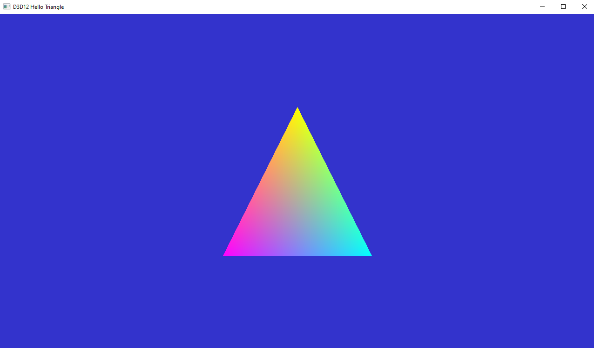

# 3 RTX Using the Vertex Buffer

## 15 Using the Vertex Buffer
The colors in our Hit shader are hardcoded in the shader, to enforce consistency between rasterization and raytracing it is better to use to color information stored in the vertex buffer. Accessing vertex buffer information is required in most practical implementations of raytracing, not only for vertex colors but also, for example, to lookup and interpolate texture coordinates or normals.

## 15.1 CreateHitSignature
The hit group originally did not require any external input as it was only processing the intersection attributes and returning a color in the payload. To access the vertex buffer, we need to tell the Hit Root signature that we will be using a shader resource view (SRV). By default, it will be bound to register(t0) in the shader. Add the following line in CreateHitSignature()

```c++
rsc.AddRootParameter(D3D12_ROOT_PARAMETER_TYPE_SRV);
```

## 16. CreateShaderBindingTable
In the SBT, we now have to pass the address of this buffer in GPU memory to the Hit shader, as specified by the root signature. In CreateShaderBindingTable(), replace the AddHitGroup call by:

```c++
m_sbtHelper.AddHitGroup(L"HitGroup", {(void*)(m_vertexBuffer->GetGPUVirtualAddress())});
```
## 17. Hit.hlsl
The last modification is to modify the Hit shader to get an access to the data. We replicate the data structure of the vertices in the HLSL code by defining STriVertex, which has the same bit mapping as the Vertex structure defined on the CPU side. We then reference a StructuredBuffer mapped to register(t0).

```c++
struct STriVertex
{ 
	float3 vertex;
	float4 color;
};
StructuredBuffer<STriVertex> BTriVertex : register(t0);
```

In the ClosestHit function of the shader, we can use the built-in PrimitiveIndex() call to obtain the index of the triangle we hit. Remove the previous hit color computation and replace it by this to access the vertex data:
```c++
    float3 barycentrics = float3(1.f - attrib.bary.x - attrib.bary.y, attrib.bary.x, attrib.bary.y);
    uint vertId = 3 * PrimitiveIndex();
    float3 hitColor = BTriVertex[vertId + 0].color * barycentrics.x + BTriVertex[vertId + 1].color * barycentrics.y + BTriVertex[vertId + 2].color * barycentrics.z;
    payload.colorAndDistance = float4(hitColor, RayTCurrent());
```

## 17.1 LoadAssets
You can verify that the vertex buffer access is working by modifying the creation of the vertex buffer in LoadAssets(). For example, by changing it to the following, the colors in both the raster and raytracing will change.

```c++
		// 17.1
		Vertex triangleVertices[] = 
		{
			{{0.0f, 0.25f * m_aspectRatio, 0.0f}, {1.0f, 1.0f, 0.0f, 1.0f}},
			{{0.25f, -0.25f * m_aspectRatio, 0.0f}, {0.0f, 1.0f, 1.0f, 1.0f}},
			{{-0.25f, -0.25f * m_aspectRatio, 0.0f}, {1.0f, 0.0f, 1.0f, 1.0f}}
		};
```


