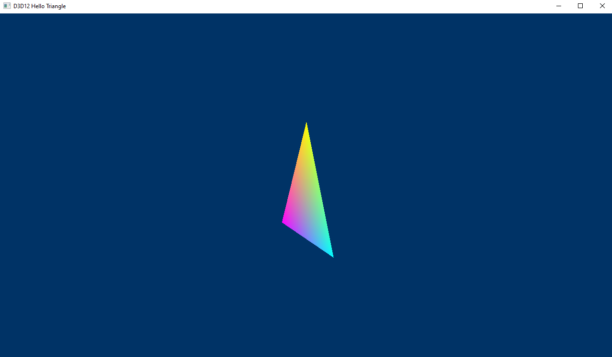
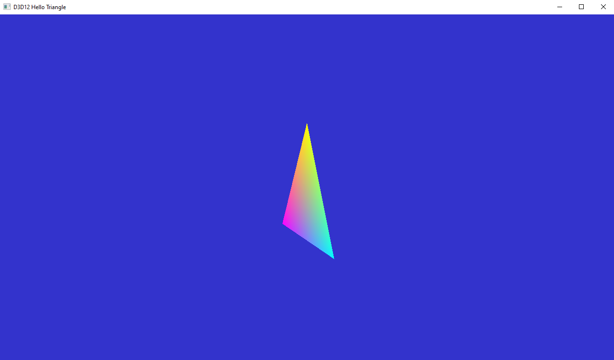

# 18. DXR Tutorial Extra : Perspective Camera

In this tutorial we will extend this to a more natural perspective camera. To do this, the camera matrices need to be passed to the shaders through a the constant buffer m_cameraBuffer. For use in the rasterization pipeline we will also create the heap m_constHeap in which the camera buffer will be referenced. Add the following declarations in the header file:

```c++
// 18. #DXR Extra: Perspective Camera
void CreateCameraBuffer();
void UpdateCameraBuffer();
ComPtr< ID3D12Resource > m_cameraBuffer;
ComPtr< ID3D12DescriptorHeap > m_constHeap;
uint32_t m_cameraBufferSize = 0;
```
At the end of the source file, add the implementation of the creation of the camera buffer. This method is creating a buffer to contain all matrices. We then create a heap referencing the camera buffer, that will be used in the rasterization path.
```c++
//----------------------------------------------------------------------------------
//
// The camera buffer is a constant buffer that stores the transform matrices of
// the camera, for use by both the rasterization and raytracing. This method
// allocates the buffer where the matrices will be copied. For the sake of code
// clarity, it also creates a heap containing only this buffer, to use in the
// rasterization path.
//
// 18. #DXR Extra: Perspective Camera
void D3D12HelloTriangle::CreateCameraBuffer() {
	uint32_t nbMatrix = 4; // view, perspective, viewInv, perspectiveInv
	m_cameraBufferSize = nbMatrix * sizeof(XMMATRIX);

	// Create the constant buffer for all matrices
	m_cameraBuffer = nv_helpers_dx12::CreateBuffer(
		m_device.Get(), m_cameraBufferSize, D3D12_RESOURCE_FLAG_NONE,
		D3D12_RESOURCE_STATE_GENERIC_READ, nv_helpers_dx12::kUploadHeapProps);

	// #DXR Extra - Refitting
	// Create a descriptor heap that will be used by the rasterization shaders:
	// Camera matrices and per-instance matrices
	m_constHeap = nv_helpers_dx12::CreateDescriptorHeap(
		m_device.Get(), 2, D3D12_DESCRIPTOR_HEAP_TYPE_CBV_SRV_UAV, true);

	// Describe and create the constant buffer view.
	D3D12_CONSTANT_BUFFER_VIEW_DESC cbvDesc = {};
	cbvDesc.BufferLocation = m_cameraBuffer->GetGPUVirtualAddress();
	cbvDesc.SizeInBytes = m_cameraBufferSize;

	// Get a handle to the heap memory on the CPU side, to be able to write the
	// descriptors directly
	D3D12_CPU_DESCRIPTOR_HANDLE srvHandle =
		m_constHeap->GetCPUDescriptorHandleForHeapStart();
	m_device->CreateConstantBufferView(&cbvDesc, srvHandle);
}
```
## 18.1 UpdateCameraBuffer
Add the following function which creates and copies the viewmodel and perspective matrices of the camera.

```c++
// 18.1 #DXR Extra: Perspective Camera
//--------------------------------------------------------------------------------
// Create and copies the viewmodel and perspective matrices of the camera
//
void D3D12HelloTriangle::UpdateCameraBuffer() 
{
	std::vector<XMMATRIX> matrices(4); 
	// Initialize the view matrix, ideally this should be based on user 
	// interactions The lookat and perspective matrices used for rasterization are 
	// defined to transform world-space vertices into a [0,1]x[0,1]x[0,1] camera 
	// space 
	XMVECTOR Eye = XMVectorSet(1.5f, 1.5f, 1.5f, 0.0f); 
	XMVECTOR At = XMVectorSet(0.0f, 0.0f, 0.0f, 0.0f); 
	XMVECTOR Up = XMVectorSet(0.0f, 1.0f, 0.0f, 0.0f); 
	matrices[0] = XMMatrixLookAtRH(Eye, At, Up); 
	float fovAngleY = 45.0f * XM_PI / 180.0f; 
	matrices[1] = XMMatrixPerspectiveFovRH(fovAngleY, m_aspectRatio, 0.1f, 1000.0f); 
	// Raytracing has to do the contrary of rasterization: rays are defined in 
	// camera space, and are transformed into world space. To do this, we need to 
	// store the inverse matrices as well. 
	XMVECTOR det; matrices[2] = XMMatrixInverse(&det, matrices[0]); 
	matrices[3] = XMMatrixInverse(&det, matrices[1]); 
	// Copy the matrix contents 
	uint8_t *pData; 
	ThrowIfFailed(m_cameraBuffer->Map(0, nullptr, (void **)&pData)); 
	memcpy(pData, matrices.data(), m_cameraBufferSize); 
	m_cameraBuffer->Unmap(0, nullptr);
}
```

## 18.2 CreateShaderResourceHeap
The camera buffer needs to be accessed by the raytracing path as well. To this end, we modify CreateShaderResourceHeap and add a reference to the camera buffer in the heap used by the raytracing. The heap then needs to be made bigger from 2 to 3, to contain the additional reference

```c++
// 18.2 #DXR Extra: Perspective Camera
// Create a SRV/UAV/CBV descriptor heap. We need 3 entries - 1 SRV for the TLAS, 1 UAV for the
// raytracing output and 1 CBV for the camera matrices
m_srvUavHeap = nv_helpers_dx12::CreateDescriptorHeap( m_device.Get(), 3, D3D12_DESCRIPTOR_HEAP_TYPE_CBV_SRV_UAV, true);
```
At the end of the method, we add the actual camera buffer reference:
```c++
// 18.2 #DXR Extra: Perspective Camera
// Add the constant buffer for the camera after the TLAS
srvHandle.ptr += m_device->GetDescriptorHandleIncrementSize(D3D12_DESCRIPTOR_HEAP_TYPE_CBV_SRV_UAV);
// Describe and create a constant buffer view for the camera
D3D12_CONSTANT_BUFFER_VIEW_DESC cbvDesc = {};
cbvDesc.BufferLocation = m_cameraBuffer->GetGPUVirtualAddress();
cbvDesc.SizeInBytes = m_cameraBufferSize;
m_device->CreateConstantBufferView(&cbvDesc, srvHandle);
```
## 18.3 CreateRayGenSignature
Since we have changed our heap and want to access the new matrices, the Root Signature of the RayGen shader must be changed. Add the extra entry to access the constant buffer through the b0 register.
```c++
rsc.AddHeapRangesParameter({ 
	{0 /*u0*/, 1 /*1 descriptor */, 0 /*use the implicit register space 0*/, D3D12_DESCRIPTOR_RANGE_TYPE_UAV /* UAV representing the output buffer*/, 0 /*heap slot where the UAV is defined*/}, 
	{0 /*t0*/, 1, 0, D3D12_DESCRIPTOR_RANGE_TYPE_SRV /*Top-level acceleration structure*/, 1}, 
	{0 /*b0*/, 1, 0, D3D12_DESCRIPTOR_RANGE_TYPE_CBV /*Camera parameters*/, 2} });
```
## 18.4 LoadAssets
The buffer starts with 2 matrices:

* The view matrix, representing the location of the camera
* The projection matrix, a simple representation of the behavior of the camera lens
Those matrices are the classical ones used in the rasterization process, projecting the world-space positions of the vertices into a unit cube. However, to obtain a raytracing result consistent with the rasterization, we need to do the opposite: the rays are initialized as if we had an orthographic camera located at the origin. We then need to transform the ray origin and direction into world space, using the inverse view and projection matrices. The camera buffer stores all 4 matrices, where the raster and raytracing paths will access only the ones needed. We now need to indicate that the rasterization shaders will use the camera buffer, by modifying their root signature at the beginning of LoadAssets. The shader now takes one constant buffer (CBV) parameter, accessible from the currently bound heap:

```c++
// 18.4 #DXR Extra: Perspective Camera
// The root signature describes which data is accessed by the shader. The camera matrices are held
// in a constant buffer, itself referenced the heap. To do this we reference a range in the heap,
// and use that range as the sole parameter of the shader. The camera buffer is associated in the
// index 0, making it accessible in the shader in the b0 register.
CD3DX12_ROOT_PARAMETER constantParameter;
CD3DX12_DESCRIPTOR_RANGE range;
range.Init(D3D12_DESCRIPTOR_RANGE_TYPE_CBV, 1, 0);
constantParameter.InitAsDescriptorTable(1, &range, D3D12_SHADER_VISIBILITY_ALL);
CD3DX12_ROOT_SIGNATURE_DESC rootSignatureDesc;
rootSignatureDesc.Init(1, &constantParameter, 0, nullptr, D3D12_ROOT_SIGNATURE_FLAG_ALLOW_INPUT_ASSEMBLER_INPUT_LAYOUT);
```
## 18.5 PopulateCommandList
Until now the rasterization path did not require access to any resources, hence we did not bind any heap for use by the shaders. Add the following lines at the beginning of the rasterization path:
```c++
// 18.5 #DXR Extra: Perspective Camera 
std::vector<ID3D12DescriptorHeap*> heaps = { m_constHeap.Get() };
m_commandList->SetDescriptorHeaps(static_cast<UINT>(heaps.size()),
	heaps.data()); // set the root descriptor table 0 to the constant buffer descriptor heap 
m_commandList->SetGraphicsRootDescriptorTable(0, m_constHeap->GetGPUDescriptorHandleForHeapStart());
```
## 18.6 OnInit
In the initialization of the application, we need to call the creation of the buffer. Add the following just after CreateRaytracingOutputBuffer().
```c++
// 18.6 #DXR Extra: Perspective Camera
// Create a buffer to store the modelview and perspective camera matrices
CreateCameraBuffer();
```
## 18.7 OnUpdate
It is not needed to update the camera matrix at each frame since it is not modified, but this is something that it is usually done. See the Camera Manipulator Section where we are adding the ability to move the the camera interactively.
```c++
// 18.7 #DXR Extra: Perspective Camera 
UpdateCameraBuffer();
```
## 18.8 shaders.hlsl
The last step to use the camera buffer for rasterization is to use the newly created buffer inside the shader. Since the buffer is associated to the register b0, we add the declaration at the beginning of the file. Note that since only the view and projection matrices are required, and they are at the beginning of the buffer, we only declare those in the shader:
```c++
// 18.8 #DXR Extra: Perspective Camera
cbuffer CameraParams : register(b0)
{
	float4x4 view; 
	float4x4 projection;
}
```
We need to modify the vertex shader to use the matrices:
```c++
PSInput VSMain(float4 position : POSITION, float4 color : COLOR)
{
	PSInput result; // 18.8 #DXR Extra: Perspective Camera 
	float4 pos = position; 
	pos = mul(view, pos); 
	pos = mul(projection, pos); 
	result.position = pos; 
	result.color = color; 
	return result;
}
```
The program should now run, showing this image in the rasterization mode: 


## 18.9 RayGen.hlsl
The raytracing mode requires changes in the ray generation shader. For this we first add the declaration of the camera buffer. Here, we use all the available matrices:

At the top of RayGen.hlsl add
```c++
// 18.9 #DXR Extra: Perspective Camera
cbuffer CameraParams : register(b0)
{
    float4x4 view; 
    float4x4 projection; 
    float4x4 viewI; 
    float4x4 projectionI;
}
```
And then for the RayDesc, modify it to be the following;
```c++
  // 18.9 #DXR Extra: Perspective Camera
  RayDesc ray;
  ray.Origin = mul(viewI, float4(0, 0, 0, 1));
  float4 target = mul(projectionI, float4(d.x, -d.y, 1, 1));
  ray.Direction = mul(viewI, float4(target.xyz, 0));
  ray.TMin = 0;
  ray.TMax = 100000;
```

Now in ray tracing mode you should see:

