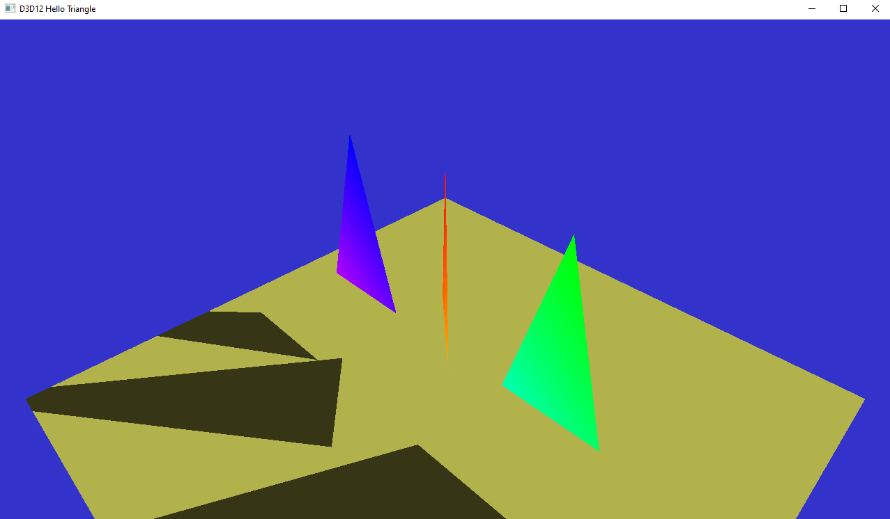

# 22. Animation Refitting
In this tutorial we will consider adding movement in the scene. While this can be done straightforwardly by completely recomputing the acceleration structures, much faster updates can be performed by simply refitting those using the new vertex coordinates or instance transforms. For the sake of simplicity this document only considers updating instance matrices and the top-level acceleration structure, but the same approach can be used to update bottom-level AS as well. In the header file, we first need to modify the signature of CreateTopLevelAS to be able to indicate whether to do a full build or a simple update:

```c++
/// Create the main acceleration structure that holds
/// all instances of the scene
/// \param instances : pair of BLAS and transform
// 22. #DXR Extra - Refitting
/// \param updateOnly: if true, perform a refit instead of a full build
void CreateTopLevelAS(const std::vector<std::pair<ComPtr<ID3D12Resource>, DirectX::XMMATRIX>>& instances, bool updateOnly = false);
```
To animate the scene, we use a simple time counter, to add at the end of the header file:
```c++
// 22. #DXR Extra - Refitting
uint32_t m_time = 0;
```
## 22.1 OnUpdate
This method is called before each render. The time counter will be incremented for each frame, and used to compute a new transform matrix for the triangle:
```c++
// 22.1 #DXR Extra - Refitting
// Increment the time counter at each frame, and update the corresponding instance matrix of the
// first triangle to animate its position
m_time++;
m_instances[0].second = XMMatrixRotationAxis({ 0.f, 1.f, 0.f }, static_cast<float>(m_time) / 50.0f)* XMMatrixTranslation(0.f, 0.1f * cosf(m_time / 20.f), 0.f);
```
## 22.2 CreateTopLevelAS
Change the signature according to the header:
```c++
void D3D12HelloTriangle::CreateTopLevelAS(const std::vector<std::pair<ComPtr<ID3D12Resource>, DirectX::XMMATRIX>>& instances, bool updateOnly
	// pair of bottom level AS and matrix of the instance 
	// 22.2 #DXR Extra - Refitting bool updateOnly 
	// If true the top-level AS will only be refitted and not 
	// rebuilt from scratch
	)
```
In case only a refit is necessary, there is no need to add the instances in the helper. Similarly, a refit does not change the size of the resulting acceleration structure so the already allocated buffers can be kept. To do that, add a condition block from the beginning of the function until the last call to CreateBuffer:
```c++
// 22.2 #DXR Extra - Refitting
if (!updateOnly)
{ 
  ...
}
```
The AS builder also needs to be informed that only a refit is necessary, by providing two optional parameters to the Build call. The first is our updateOnly flag to indicate a refit, and the second is the existing acceleration structure. This is required to be able to update it, and provides the flexibility to either update the AS in place, or to make a copy.

## 22.3 PopulateCommandList
The last piece is a call to `CreateTopLevelAS` for each frame. The AS builder requires an open command list, so we add the call at the beginning of the
raytracing branch:
```c++
// 22.3 #DXR Extra - Refitting 
// Refit the top-level acceleration structure to account for the new transform matrix of the 
// triangle. Note that the build contains a barrier, hence we can do the rendering in the 
// same command list 
CreateTopLevelAS(m_instances, true);
```
That's all you need!


